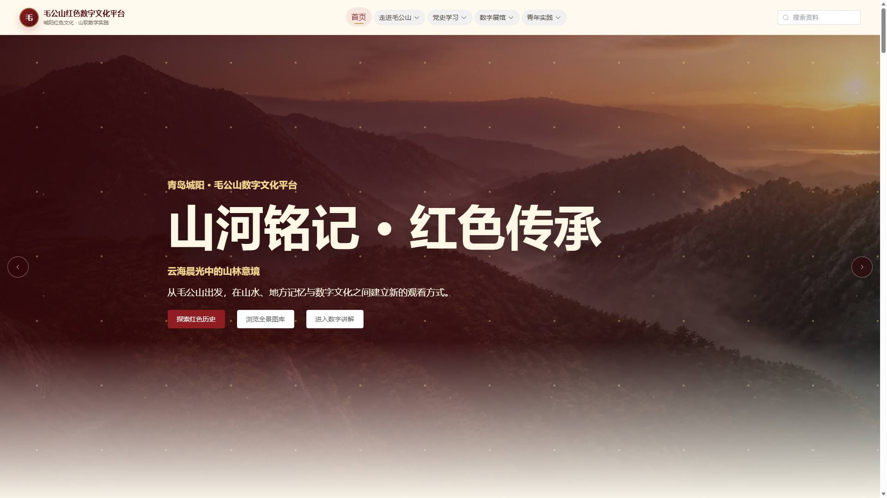
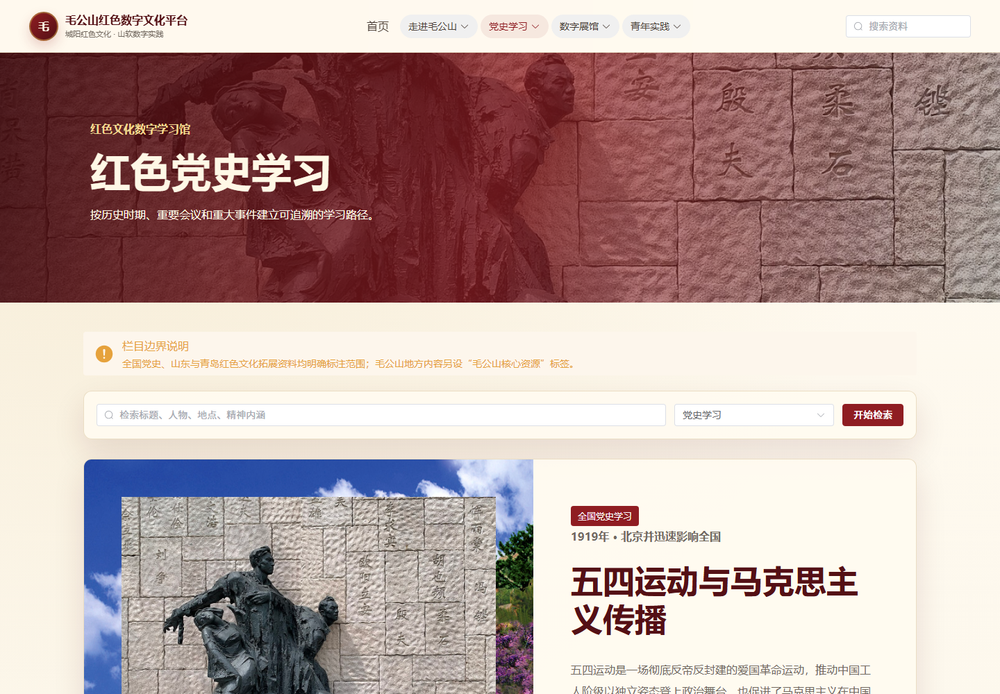
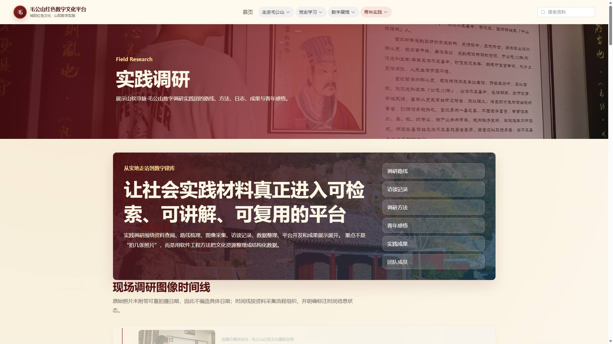
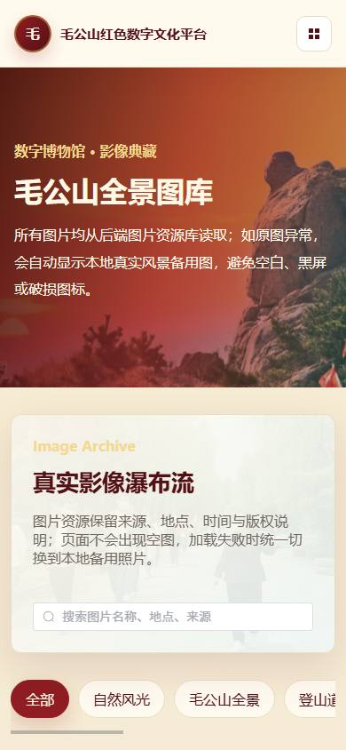
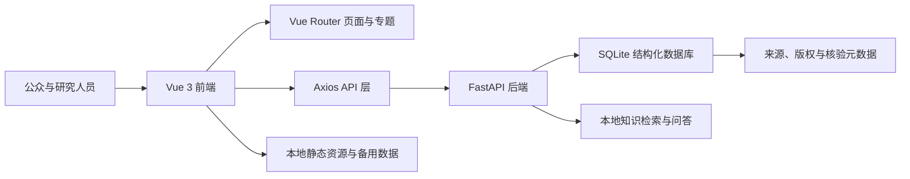

# 毛公山红色文化数字资源平台

<p align="center">
  <strong>面向红色文化调研、数字化保护、公众传播与研学实践的全栈数字平台</strong>
</p>

<p align="center">
  <a href="https://github.com/yumingye/MaoGongShan-Red-Culture-Platform"></a>
  
  
  
  <a href="LICENSE"></a>
</p>

## 项目摘要

毛公山红色文化数字资源平台是山东大学软件学院毛公山红色文化调研社会实践的数字化成果。项目围绕青岛市城阳区毛公山及周边红色文化资源，开展现场走访、图像采集、公开资料核验、结构化数据整理和数字传播实践，形成集文化展示、党史学习、资源检索、地图导览、图文微课与知识问答于一体的 Web 平台。

平台强调“地方调研资料、全国党史拓展、当代实景影像、项目自制图解”四类内容的边界，通过来源字段、核验状态、版权说明和安全媒体组件提升资料的可追溯性。项目既服务社会实践成果展示与课程答辩，也可作为地方红色文化资源数字化组织、传播和研学设计的工程案例。

## 项目背景

| 项目要素 | 内容 |
| --- | --- |
| 实践单位 | 山东大学软件学院 |
| 实践主题 | 毛公山红色文化资源调研与数字化传播 |
| 调研区域 | 山东省青岛市城阳区毛公山及周边区域 |
| 建设目标 | 以数字技术支持红色文化资料整理、公众传播、研学导览与成果沉淀 |
| 主要受众 | 社会实践团队、学生、教师、游客及地方文化研究者 |
| 项目性质 | 教育、研究与公益展示；不替代地方志、档案馆等权威史料 |

### 研究与实践目标

1. 对毛公山相关照片、路线、景点、文化叙事和实践过程进行结构化归档。
2. 探索红色文化内容在响应式网页、地图导览和交互学习中的传播方式。
3. 建立包含来源、版权与核验状态的数据记录机制，降低资料误用风险。
4. 验证前后端分离、SQLite 知识库和本地检索问答在轻量文化平台中的可行性。
5. 形成可复现、可扩展、适合 GitHub 协作维护的开源工程样例。

## 核心功能

| 模块 | 功能说明 |
| --- | --- |
| 毛公山概览 | 展示地理环境、名称由来、自然风光、文化价值和游览建议 |
| 党史学习 | 提供党史阶段、历史事件、人物资料、红色精神专题和交互时间轴 |
| 数字资源库 | 支持文献、图片、音频、实践成果等资源的分类、搜索与详情浏览 |
| 全景图库 | 展示现场调研照片及缩略图、移动端图、详情图等多尺寸资源 |
| 地图导览 | 提供景点点位、分类筛选和研学路线；未配置地图 Key 时自动降级 |
| 实践成果 | 呈现调研日志、实践计划、团队专题、成果材料与方法总结 |
| 智能问答 | 基于 SQLite 知识库进行本地检索式问答，并返回相关资料来源 |
| 个性化浏览 | 提供关键词搜索、收藏、最近浏览和相关推荐 |
| 内容管理 | 支持历史事件、人物、资源和图片的基础管理；公网可启用只读模式 |
| 稳定性设计 | 提供接口重试、离线备用数据、图片降级、页面错误边界和深层路由回退 |

## 数据规模

当前公开数据库包含以下结构化内容：

| 数据类型 | 数量 |
| --- | ---: |
| 历史事件 | 51 条 |
| 历史人物 | 30 条 |
| 数字资源 | 312 条 |
| 图库记录 | 167 条 |
| 调研日志 | 55 条 |
| 音频讲解 | 22 条 |
| 红色故事 | 55 条 |
| 地点资源 | 32 条 |
| 实践成果 | 30 条 |
| 党史学习专题 | 53 篇 |
| 地图点位 | 14 个 |

> 数据数量以仓库当前公开 SQLite 数据库为准。内容持续维护时，应同步更新来源说明和核验状态。

## 项目截图

### 首页与党史学习

| 平台首页 | 党史学习专题 |
| --- | --- |
|  |  |

### 实践调研与移动端展示

| 调研成果页面 | 移动端风景页面 |
| --- | --- |
|  |  |

更多桌面端和移动端截图位于 [`docs/screenshots/`](docs/screenshots/)。

## 系统架构



前端负责内容展示、交互检索、响应式布局和异常降级；后端提供 REST API、数据初始化、知识检索及受保护的管理接口；SQLite 保存结构化研究资料，根目录 `assets/` 保存媒体源文件。

## 技术栈

| 层级 | 技术 | 用途 |
| --- | --- | --- |
| 前端框架 | Vue 3.5、Vite 8 | 组件化页面与开发构建 |
| 前端路由 | Vue Router 4 | 专题、详情页和深层路由 |
| UI 与交互 | Element Plus、CSS 响应式设计 | 导航、表单、卡片与多端布局 |
| HTTP 客户端 | Axios | API 请求、超时和错误处理 |
| 后端框架 | Python 3.10+、FastAPI 0.115、Uvicorn | REST API 与服务运行 |
| 数据存储 | SQLite | 轻量结构化资料库与本地知识库 |
| 媒体处理 | Pillow | 图片导入、方向修正与多尺寸 WebP 生成 |
| 配置管理 | python-dotenv、Vite 环境变量 | 本地开发和部署环境隔离 |
| 质量检查 | Node.js 检查脚本、无头浏览器巡检 | 数据、图片、接口、路由和响应式验证 |
| 部署 | Render Blueprint | 静态前端与 Python API 分离部署 |

## 项目结构

```text
MaoGongShan-Red-Culture-Platform/
├── frontend/                 # Vue 前端
│   ├── public/data/          # 前端公开数据清单
│   ├── scripts/              # 质量、资源与浏览器检查
│   └── src/                  # 页面、组件、路由、API 与数据
├── backend/                  # FastAPI 后端及数据维护脚本
│   ├── app.py                # API 应用入口
│   ├── config.py             # 环境配置
│   └── requirements.txt      # Python 依赖
├── database/                 # 公开 SQLite 数据库与照片清单
├── assets/                   # 图片、视频等源静态资源
├── docs/                     # 来源、结构、测试、部署与截图文档
├── scripts/                  # 启停、验证和打包脚本
├── tools/                    # 辅助分析工具
├── .env.example              # 配置索引，不含真实密钥
├── .gitignore
├── CONTRIBUTING.md
├── SECURITY.md
├── LICENSE
├── render.yaml
└── README.md
```

`assets/` 是媒体资源的唯一源码目录。安装依赖、启动、测试或构建前，前端脚本会将其同步到被 Git 忽略的 `frontend/public/assets/`，现有 `/assets/...` 页面地址因此保持不变，仓库也不会保存重复资源。

## 项目运行教程

### 1. 环境要求

- Git
- Python 3.10 或更高版本
- Node.js `^20.19.0` 或 `>=22.12.0`，推荐使用当前 Node.js LTS
- npm

### 2. 获取代码

```powershell
git clone https://github.com/yumingye/MaoGongShan-Red-Culture-Platform.git
cd MaoGongShan-Red-Culture-Platform
```

### 3. Windows 一键启动

双击根目录的 `start.bat`，或在 PowerShell 中执行：

```powershell
.\scripts\start-project.ps1
```

脚本会创建 Python 虚拟环境、安装依赖、同步静态资源并启动前后端。启动完成后访问：

- 前端：<http://127.0.0.1:5173>
- 后端接口：<http://127.0.0.1:8000>
- Swagger 文档：<http://127.0.0.1:8000/docs>
- 健康检查：<http://127.0.0.1:8000/api/health>

停止服务：

```powershell
.\scripts\stop-project.ps1
```

### 4. 手动启动后端

```powershell
python -m venv backend\.venv
backend\.venv\Scripts\python.exe -m pip install -r backend\requirements.txt
backend\.venv\Scripts\python.exe -m backend.init_db
backend\.venv\Scripts\python.exe -m uvicorn backend.app:app --host 127.0.0.1 --port 8000
```

### 5. 手动启动前端

打开第二个终端：

```powershell
cd frontend
npm ci
npm run dev
```

开发环境中，Vite 将 `/api` 和 `/static` 代理到 `http://127.0.0.1:8000`。

## 环境配置

需要本地覆盖配置时，复制示例文件：

```powershell
Copy-Item backend\.env.example backend\.env
Copy-Item frontend\.env.example frontend\.env
```

### 后端变量

| 变量 | 说明 |
| --- | --- |
| `BACKEND_HOST` / `BACKEND_PORT` | 后端监听地址和端口 |
| `DATABASE_URL` | SQLite 路径；相对路径从项目根目录解析 |
| `UPLOAD_DIR` | 后端上传目录 |
| `CORS_ORIGINS` | 允许访问 API 的前端 Origin，多个地址用逗号分隔 |
| `READ_ONLY_MODE` | 公网展示建议设为 `true`，关闭写入和上传 |
| `ADMIN_USERNAME` / `ADMIN_PASSWORD` / `ADMIN_TOKEN` | 本地管理凭据，必须自行设置 |
| `LLM_PROVIDER` / `LLM_API_KEY` / `LLM_BASE_URL` / `LLM_MODEL` | 可选外部模型配置 |

### 前端变量

| 变量 | 说明 |
| --- | --- |
| `VITE_API_BASE_URL` | 正式环境 API 地址；本地开发留空使用代理 |
| `VITE_DEV_PROXY_TARGET` | 本地代理目标，默认 `http://127.0.0.1:8000` |
| `VITE_PUBLIC_READ_ONLY` | 公网构建只读提示开关 |
| `VITE_AMAP_KEY` | 可选高德地图 Web JS API Key |
| `VITE_AMAP_SECURITY_CODE` | 可选高德地图安全密钥 |

真实 `.env`、密码、Token 和 API Key 均不得提交到 Git。

## 构建与质量验证

启动后端后，在 `frontend` 目录执行：

```powershell
..\backend\.venv\Scripts\python.exe ..\backend\check_api_contract.py
..\backend\.venv\Scripts\python.exe ..\backend\check_upload_validation.py
npm run lint
npm run test
$env:VITE_API_BASE_URL="https://your-api.example.com"
npm run build
npm run check:deploy
```

生产构建必须显式提供 HTTPS API 地址；若配置为 `localhost` 或 `127.0.0.1`，构建会直接失败，避免将本地接口误发布到线上。

浏览器布局巡检：

```powershell
npm run check:browser
```

浏览器检查支持按场景拆分，适合在资源受限的 CI 或 Windows 环境中定位问题：

```powershell
$env:BROWSER_QUICK="1"                 # 核心页面快速巡检
$env:BROWSER_ONLY_INTERACTIONS="1"     # 时间轴、轮播、灯箱、闯关等交互专测
$env:BROWSER_ONLY_RESILIENCE="1"       # 断网、慢网、坏图与 API 阻断专测
npm run check:browser
```

当前检查覆盖：

- 页面源码中的占位内容、乱码和旧资源路径。
- API 健康状态、列表数量、详情接口和本地检索问答。
- 图库文件存在性、图片尺寸和多尺寸照片变体。
- 党史文章、章节媒体、人物图片和来源字段的一致性。
- 核心路由、移动端布局、横向溢出、失败图片和运行时异常。
- Render 构建产物、环境变量和 SPA Rewrite 配置。

## 数据来源、伦理与安全

- 调研照片、公开历史资料和第三方媒体均应记录来源与版权说明。
- 当代旧址、纪念馆照片和项目自制图解不标注为历史现场影像。
- 公开数据库发布前使用 `backend/sanitize_public_db.py` 清除问答记录和访问记录。
- 公共仓库不收录手机号、身份证号、私人邮箱、家庭住址或本机绝对路径。
- 公网演示环境建议启用只读模式，不保存后台编辑、上传和访问行为。
- 图片与第三方资料不当然适用 MIT License，应遵循各自来源标注的许可条件。

详细资料参见：

- [数据来源说明](docs/DATA_SOURCES.md)
- [图片来源说明](docs/IMAGE_SOURCES.md)
- [照片导入报告](docs/PHOTO_IMPORT_REPORT.md)
- [安全说明](SECURITY.md)

## 部署

生产环境统一部署到 Render，仓库根目录的 `render.yaml` 会复用同名服务并配置：

- 前端 Static Site：`https://maogongshan-red-culture-web-yumingye.onrender.com`
- 后端 FastAPI：`https://maogongshan-red-culture-api-yumingye.onrender.com`
- 数据库：公开只读实例启动时将仓库中的种子 SQLite 复制到托管平台临时目录。

Blueprint 已写入前端 HTTPS API 地址、后端精确 CORS 来源、SPA Rewrite、`0.0.0.0:$PORT` 和安全响应头。开发环境仍通过 Vite 代理访问本地后端；生产构建会拒绝 `localhost` 或 `127.0.0.1` API 地址。`netlify.toml` 仅作为备用部署配置保留。

完整上线顺序、环境变量、验证命令和故障排查参见 [生产部署指南](docs/DEPLOYMENT.md)。

## 当前限制

- 在线高德地图需要使用者自行申请 Web JS API Key 与安全密钥；未配置时使用静态导览。
- 外部大模型属于可选增强项；未配置时使用 SQLite 本地检索问答。
- 受版权限制的视频不随仓库分发，相关页面使用来源明确的图文内容和媒体降级。
- Render 免费文件系统不适合持久写入，公开实例默认使用临时 SQLite 副本和只读后台。
- 平台内容用于教育与研究展示，历史结论仍应以权威档案、地方志和正式出版物为准。

## 未来优化方向

1. **数据治理**：建立资料版本、审核人、核验日期和引用关系，形成更完整的数据谱系。
2. **检索能力**：引入全文索引、语义检索和可解释的多来源排序，提升查询质量。
3. **空间叙事**：完善地图点位、调研轨迹和研学路线，探索时空关联可视化。
4. **多媒体传播**：扩充经过授权的音频、视频、口述史和无障碍讲解内容。
5. **用户研究**：开展可用性测试和传播效果评估，形成定量与定性研究数据。
6. **工程质量**：将现有 API 契约检查接入 CI，并增加依赖安全扫描和可重复发布流程。
7. **数据持久化**：在需要协作编辑时迁移至 PostgreSQL，并建设权限、审计和备份机制。
8. **开放协作**：完善 Issue、Pull Request、数据纠错和学术引用流程。

## 贡献与引用

欢迎通过 Issue 提交资料纠错、来源补充、界面问题和改进建议。参与开发前请阅读 [贡献指南](CONTRIBUTING.md)，安全或隐私问题请按照 [安全说明](SECURITY.md) 私下报告。

在课程报告、社会实践成果或研究材料中引用本项目时，建议注明：

> 山东大学软件学院毛公山红色文化调研项目：《毛公山红色文化数字资源平台》，2026。

## 许可证

项目代码采用 [MIT License](LICENSE)。图片、历史资料、文字来源和其他第三方内容遵循各自来源页面标注的版权与使用条件。
